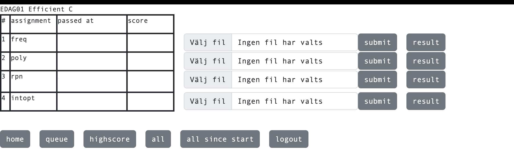

# Forza
Command line interface for interacting with [Forsete](https://forsete.cs.lth.se).  
Usage:
``
forza <course> <assignment index> <file path>
``
The `FORSETE_USERNAME` and `FORSETE_PASSWORD` environment variables MUST be set.

## Example
Consider the following view in Forsete:


If we want to upload a solution to `rpn`, the command would be:
``forza "Efficient C" 2 rpn.c``

Upon executing the command, your solution will be uploaded to Forsete. After which 
Forza will connect to the machine and attempt to retrieve the contents of the `forsete.output`
file.

## Installation
You have a few options for installation. Forza is a Java program, so I've simply put the jar file in a
convenient location on my `PATH` alongside this script:
```sh
#!/bin/bash

SCRIPT_DIR="$(dirname "$0")"

JAR_FILE="$SCRIPT_DIR/forza.jar"

java -jar $JAR_FILE "$@"
```
and marked the script as executable. That way I can simply call the script from anywhere on my system. You
can also place the jar file wherever you wish to and just hide all the logic in the Makefiles for your
assignments.

I find it very convenient to add:
```
FILE	= assignment

forza:
	forza "Efficient C" 2 $(FILE).c

```
to my `Makefile` and just running `make forza` afterwards.  

I provide prebuilt Java JARs using Github actions, you can of-course just build it yourself using Gradle.

## Why Java and not C?
I needed this to be portable, considering I work on both a Mac computer and a Linux system for this course.
I struggled to find a hassle-free library for handling SSH connections that was portable. Using Java means
I get to enjoy the portability of the Java-bytecode.
